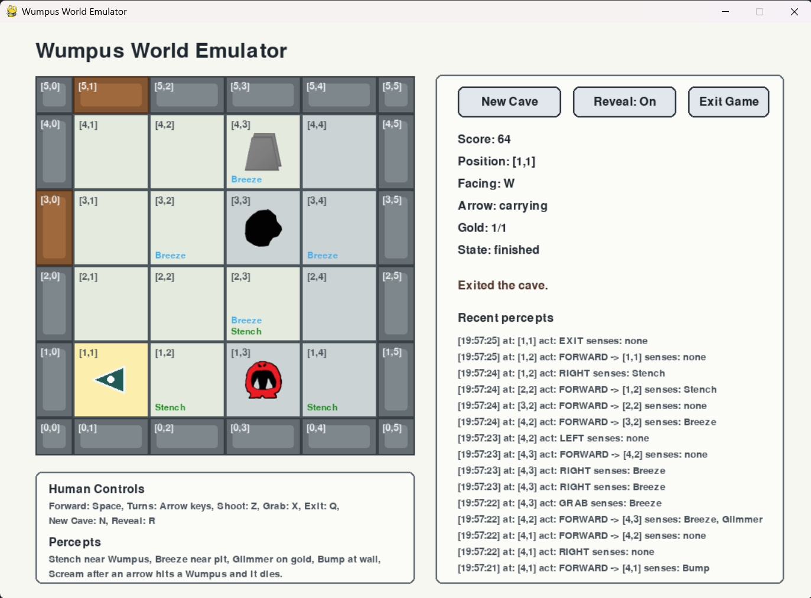

# Assignment 3: Navigating Wumpus World: Task 2

## Foreword

The game emulator was created through vibe coding with OpenAI Codex. It is amazing to see what GenAI models are capable of these days.
However, I noticed that once the game logic becomes complex, manually modifying the code becomes much harder without introducing compilation errors here and there. Even small changes can lead to a lot of debugging. In the end, continuing to vibe code felt like the only practical option.

I have coded my own solution and also vibe-coded one.
My overall feeling is that vibe coding is both an elixir and a poison: your solution may achieve a good score,
but you will learn very little if you do not spend time understanding it.
It is good at producing quick-and-dirty solutions for low-risk problems, but if you are responsible for what your code does, you may eventually prefer to write it yourself.

Please try to work out a solution yourself. It is not an easy assignment, and you will generally feel more accomplished
after solving it on your own.
If you would like some help, see the [Tips](documentation/tips.md).


## Assignment Objective

In this assignment, you will program a Wumpus Agent capable of intelligently navigating several different caves.
You may use whatever logic or algorithmic approaches you would like.
The goal of your agent is to exit the game with a positive score.

## Setup

The main dependency for the game is [Pygame](https://www.pygame.org/news). Use the following command to install the dependencies:

```bash
python -m pip install -r requirements.txt
```

## Quick Start

The game is playable by a human, and playing it yourself is probably the best way to understand how it works.
To run the human-controlled agent:

```bash
python human_agent.py --cave default
```



### Key Mapping

- `Space`: move forward
- `Left`: turn left
- `Right`: turn right
- `Z`: shoot arrow
- `X`: grab gold
- `Q`: exit at the starting square
- `N`: spawn a new cave
- `R`: reveal or hide the full cave

### Input Arguments

All launchers (`human_agent.py`, `my_agent.py`, `random_agent.py`) accept:

- `--config`: path to the main game config file. You do not need to change this.
- `--cave`: cave profile name, e.g. `gold` or `default`.
- `--show-window`: override `emulator.show_window` with `true` or `false`, which lets the game run in visual or silent mode.
- `--seed`: override `cave.seed` with an integer if you want to make sure the same map is loaded. Note that new games created after the first game will be randomised.

The human agent requires a visible Pygame window for keyboard input, so `human_agent.py` opens the window by default even if `game_config.yaml` has `show_window: false`.

### Bug reports

If you find any bugs in the game, please feel free to submit an issue on GitHub.

## Portals

Here are the portals to help you navigate the assignment:

* Main Page <--- you are here
* [Task Description](documentation/task_description.md)
* [Evaluation](documentation/evaluation.md)
* [Support Functions](documentation/support_functions.md)
* [Tips](documentation/tips.md)


